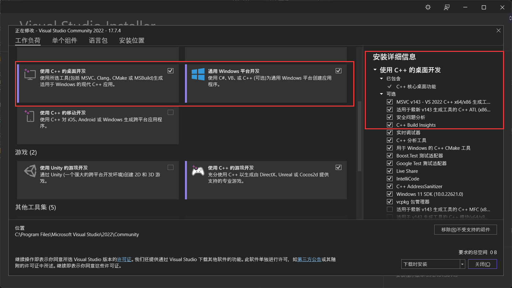

# 计算机图形学实验作业存档
本实验作业答案为个人编写，仅供参考。
# 依赖
本项目使用 OpenGL 和 C++ 完成，所使用的 OpenGL 版本号为 3.3，依赖于 [64 位 GLFW](https://www.glfw.org/)、[GLAD](https://glad.dav1d.de/)、[GLM](https://github.com/g-truc/glm) 完成。
# 配置
你可以参考 [LearnOpenGL-CN](https://learnopengl-cn.github.io/01%20Getting%20started/02%20Creating%20a%20window/) 的教程来配置。不过，我已经提前配置好了本项目，你只需要下载整个项目后直接运行，就能达到理想的效果。
# 常见问题
如果使用的平台工具集版本不是 v143 时，可能会遇到下列问题
```
无法找到 v143 的生成工具(平台工具集 =“v143”)
```
本作业项目最开始使用 Visual Studio 2019 开发，最后几次更新则是使用 Visual Studio 2022 更新，除了修复几个错误，还把项目的平台工具集从 v142 升级到了 v143，因此如果你使用的平台工具集和该版本不一致，则有可能出现该问题。可行的解决方法有两个：
- 方法之一：下载 Visual Studio 2022 并附带下载 v143 平台工具集，你只需要在安装 Visual Studio 2022 的时候勾选上“**使用 C++ 的桌面开发**”和“**通用 Windows 平台开发**”即可。

- 方法之二：降级项目的平台工具集。在 Visual Studio 中打开项目，然后右键点击解决方案。

<br>在接下来的菜单中找到属性，点击之。

<br>然后在上方的配置中选择“**所有配置**”并在平台中选择“**活动(x64)**”。

<br>接着将平台工具集更换为你现在的版本。

<br>对其他项目同样执行一样的操作，务必记得点击“**确定**”或者“**应用**”来保存你的设定。
<br>完成，应当可以正常编译运行了。
# 仍有问题？
请在[本仓库的 Issues 界面提问题](https://github.com/1012796366/glExperiment/issues)。